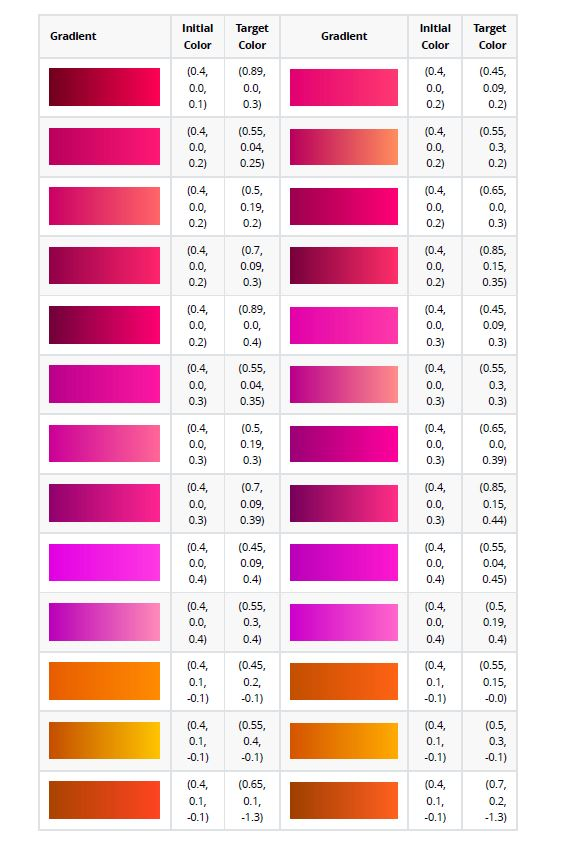
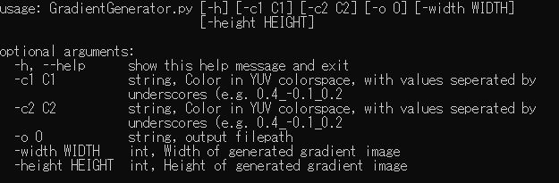

# Gradients Library


## What's in this Repository?

**5533 Linear Gradients** free to use for both commercial and non-commercial projects. This repository is distributed under CC0: Attribution not required, but appreciated.  

You can download the gradients from this repository or from itch: https://wally869.itch.io/gradients-library  

Gradient Images are provided as 301*100 jpg files (small mistake on my part for the sizing, might fix it later).

The repository also contains a **pdf file (GradientsLibrary.pdf)** for you to scroll through all the gradients efficiently. What's more, the pdf file contains YUV coordinates of all
gradients.

You can use these coordinates as inputs to the GradientGenerator script to generate a bigger image file if needed.

Quick look at GradientsLibrary.pdf:  



## How to use the Gradient Generator script?  

The only dependency needed should be imageio.  

Argparse has been setup so the script can be called directly from CLI:  
```commandline
python GradientGenerator.py -c1 0.4_0.1_-0.1 -c2 0.55_0.4_-0.1
```

All Parameters can be accessed with -h:
```commandline
python GradientGenerator.py -h
```




## More Gradients  

The gradients were generated by looping over combinations of YUV values in a very naive way.  
I'll try to provide other types of gradients (radial, stepped) after I make a better version of my algo.

I might set up a static website on github pages to generate gradients on demand.  

